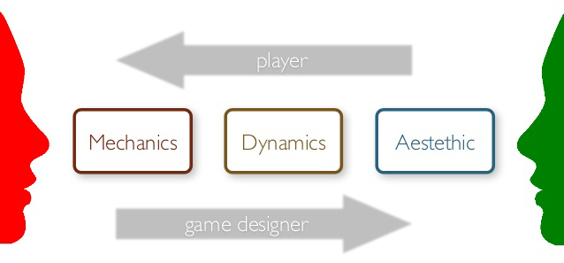

# Overview

The **[Mechanics, Dynamics, Aesthetics][mda-wikipedia]** (MDA) framework is one of the early (2004) attempts to develop a theory of game design.

We will practice on the classic version of Tic-Tac-Toe and then you will create an MDA chart for your modified version of Tic-Tac-Toe using the [template][].

<!-- Don't edit links here, change them in _data/assignment.yml instead, -->

[mda-paper]: <{{site.data.assignment.mda-paper}}>
[mda-wikipedia]: <{{site.data.assignment.mda-wikipedia}}>
[slides]: <{{site.data.assignment.slides}}>
[template]: <{{site.data.assignment.template}}>
